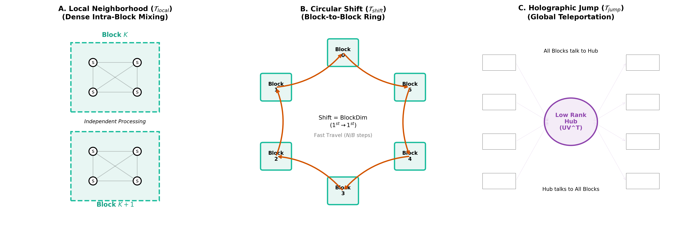
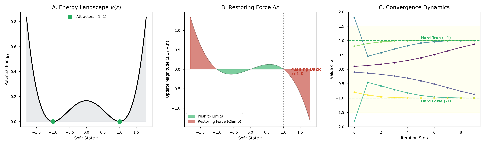
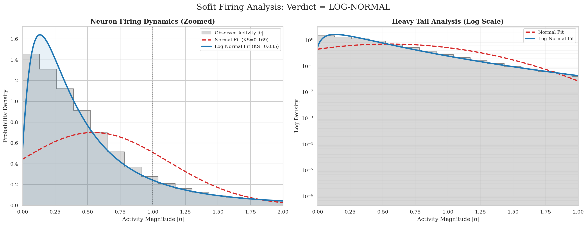

# Sofistron: The Soft-Bit Recurrent Orchestrator

**Sofistron** is a minimalist recurrent architecture that challenges the complexity of modern Large Language Models. By eschewing Attention, LayerNorm, and standard non-linearities in favor of **Continuous Boolean Logic** and **Small-World Topology**, it matches Transformer performance on character-level benchmarks with **10x fewer parameters**.

---

## ⚡ Performance Benchmark (TinyShakespeare)

We evaluate the Sofistron against **NanoGPT**, the standard educational Transformer baseline.

| Model | Parameters | Val Loss | Architecture |
| :--- | :--- | :--- | :--- |
| **NanoGPT** | ~10.6M | 1.47 - 1.49 | Transformer (6 Layers, 6 Heads) |
| **Sofistron-Base** | **0.81M** | **1.489** | **Soft-Bit RNN** (Pure Logic) |
| **Sofistron-Tiny** | **0.34M** | 1.516 | Soft-Bit RNN (Pure Logic) |

> **Key Result:** Sofistron achieves parity with Transformer models using approximately **92% fewer parameters** and linear $O(T)$ time complexity.

---

## 🏗️ Core Innovations: "No Magic, Just Logic"

Modern deep learning often relies on a "bag of tricks" to stabilize training. The Sofistron removes them to test a radical hypothesis: **Is a stable logical basis sufficient for intelligence?**

| Feature | Transformer / Modern RNN | Sofistron |
| :--- | :--- | :--- |
| **Complexity** | $O(T^2)$ (Attention) | **$O(T)$ (Recurrent)** |
| **Positional Encoding** | Explicit (Rotary/Sinusoidal) | **Implicit** (Topological Shift) |
| **Normalization** | LayerNorm / RMSNorm | **None** (Whitened Spectral Basis) |
| **Activation** | ReLU / GeLU / SiLU | **Bilinear Interaction ($xy$)** |
| **Connectivity** | Dense All-to-All | **Sparse Small-World** |

### 1. The Sofit (Soft-Bit)
Instead of neurons that sum inputs ($w \cdot x$), **Sofits** compute continuous boolean functions. We use a **Whitened Spectral Basis** derived from the Walsh-Hadamard transform:
$$\mathcal{B} = \left\lbrace 1, \quad \frac{x+y}{2}, \quad \frac{x-y}{2}, \quad xy \right\rbrace$$
This basis allows the network to naturally model XOR/XNOR relationships (parity) which are difficult for standard additive neurons, explaining the "Multiplicative" power often attributed to Attention.

### 2. Small-World Topology
We replace dense matrix multiplication with a structured, sparse mixing protocol inspired by biological networks:
1.  **Local:** Dense mixing within small communities.
2.  **Shift:** Circular information flow (replacing Positional Encodings).
3.  **Jump:** Long-range teleportation via a low-rank hub.

### 3. The Ghost Term (Quantization)
While our main results use pure soft logic ($\nu=0$), the architecture supports a "Ghost Term" derived from the double-well potential $V(z) \propto (1-z^2)^2$. This term acts as a restorative force, allowing the network to self-quantize into discrete hard bits ($\pm 1$) post-training.

---

## 🧠 Emergent Biology

Unlike standard ANNs which exhibit Gaussian activation statistics (due to the Central Limit Theorem on additive sums), the Sofistron exhibits **Log-Normal firing statistics**.

This aligns closely with firing rates observed in biological neural networks, suggesting that the Sofistron's multiplicative processing may be a more biologically plausible approximation of intelligence.

---

## 🚀 Quick Start

Train a Sofistron on the TinyShakespeare dataset in <10 minutes on a standard T4 GPU, or load the already trained Sofistron Base and Sofistron Tiny using the .ipynb code provided!

@misc{correales2026sofistron,
  title={Sofistron: Soft-bit Recurrent Orchestrator Network},
  author={Correales Fernández, Álvaro Isidro},
  year={2026},
  publisher={GitHub},
  note={[https://github.com/AlvaroLearning/sofistron](https://github.com/AlvaroLearning/sofistron)}
}

## License

This project is dual-licensed:

1.  **Code and Model Weights:** The source code, scripts, and pre-trained model weights (`*.pt`, `*.safetensors`) are released under the **Apache License 2.0**. See `LICENSE` for details.
2.  **Research Paper:** The academic paper (`sofistron.pdf`) and associated diagrams are released under the **Creative Commons Attribution 4.0 International (CC BY 4.0)** license. You are free to share and adapt the text and figures as long as you provide appropriate credit. See `LICENSE_PAPER` for details.
